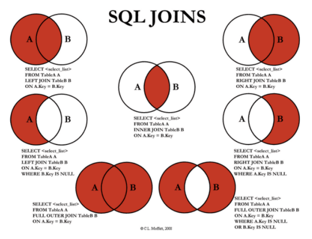

# 📚 0822 데이터베이스(DB)

## 📌 Join
```SQL
-- Join
  - 관계형 데이터베이스의 가장 큰 장점이자 핵심적인 기능
  - 일반적으로 데이터베이스에는 하나의 테이블에 많은 데이터를
    저장하는 것이 아니라 여러 테이블로 나눠 저장하게 되며, 
    여러 테이블을 결합(Join)하여 출력하여 활용
  - 일반적으로 레코드는 
    기본키(PK)나 외래키(FK) 값의 관계에 의해 결합함

-- 대표적인 JOIN
  1) INNER JOIN: 두 테이블에 모두 일치하는 행만 반환
    - 예시
    : SELECT * FROM 테이블1 [INNER] JOIN 테이블2
        ON 테이블1.칼럼 = 테이블2.칼럼;

    Q. 사용자(users)와 각각의 역할을 출력하시오.
    A. SELECT * FROM users INNER JOIN role
       ON users.role_id = role.id;

    Q. staff(2) 사용자(users)를 역할과 함께 출력하시오.
    A. SELECT * FROM users INNER JOIN role
       ON users.role_id = role.id
       WHERE role.id = 2;

    Q. 사용자(users)와 각각의 역할을 이름의 내림차순으로 출력하시오.
    A. SELECT * FROM users INNER JOIN role
       ON users.role_id = role. id
       ORDER BY users.name DESC;

  2) OUTER JOIN: 동일한 값이 없는 행도 반환
    - 기준이 되는 테이블에 따라 LEFT/RIGHT/FULL을 지정
    - 예시
    : SELECT * FROM 테이블 1 [LEFT|RIGHT|FULL] OUTER JOIN 테이블2
        ON 테이블1.칼럼 = 테이블2.칼럼; 

    Q. 모든 게시글을 사용자 정보와 함께 출력하시오.
    A. SELECT * FROM articles LEFT OUTER JOIN users
       ON users.id = articles.user_id;

    Q. 작성자가 있는 모든 게시글을 사용자 정보와 함께 출력하시오.
    A. SELECT * FROM articles LEFT OUTER JOIN users
       ON users.id = articles.user_id
       WHERE articles.user_id IS NOT NULL;

    Q. 모든 게시글과 모든 사용자 정보를 출력하시오.
    A. SELECT * FROM articles FULL OUTER JOIN users
       ON users.id = articles.user_id;

  3) CROSS JOIN: 모든 데이터의 조합
    - 예시
    : SELECT * FROM 테이블 1 CROSS JOIN 테이블2;

    Q. users와 role의 CROSS JOIN 결과를 출력하시오.
    A. SELECT * FROM users CROSS JOIN role;

-- SQL Joins Visualizer
https://sql-joins.leopard.in.ua/
```

