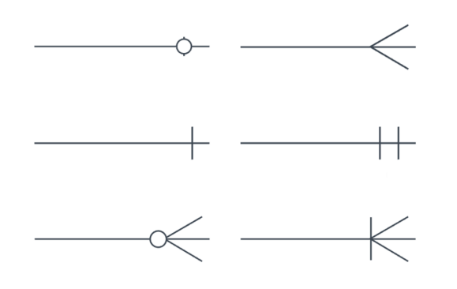

# 📚 0823 데이터베이스(DB)

## 📌 모델링
```SQL
-- 모델링
- 데이터베이스의 구조나 형식으로 모델 구조만 보고 
  어떤 데이터를 다루는지 알 수 있음

- 개념적 데이터 모델링
   - 데이터의 요구사항을 찾고 분석하는 과정, 
     핵심 개체(Entity) 사이의 관계를 찾아내고 표현

- 논리적 데이터 모델링
   - 데이터베이스 설계 프로세스의 과정으로 
     정보의 논리적인 구조와 규칙을 명확하게 표현하는 기법/과정

- 물리적 데이터 모델링
   - 논리적 데이터 모델이 데이터 저장소로서 
     어떻게 실제로 저장될 것인가

-- ERD
- ERD(Entity Relation Diagram) - 개체 관계 모델
- 주요용어
   - 엔터티(Entity)
   : 업무과 관여하는 정보

   - 속성(Attribute)
   : 엔터티가 가지는 성격, 데이터 타입과 크기 및 제약사항 지정

   - 관계(Relationship)
   : Entity 간의 관계, 연관성

- 관계
   - 카디널리티(Cardinality): 수적 관계
      - 1:1 관계: A는 B를 하나 가진다. B는 A를 하나 가진다.
      - 1:N 관계: A는 B를 여러 개 가진다. B는 A의 하나에 해당한다.
      - M:N 관계: A는 B를 여러개 가진다. B는 A를 여러 개 가진다.
   
   - 옵셔널리티
      - (1)필수
      - (0)선택

-- 정규화
- 데이터베이스 테이블을 설계하는 과정에서 중복성을 제거하여 성능 향상
- 정규화 종류
   - 제1정규화: 도메인 원자값
      - 한 속성에 여러 개의 속성이 포함, 
        같은 유형의 속성이 여러 개로 나눠져 있는 경우 제거 

   - 제2정규화: 부분적 함수 종속성 제거
      - PK가 아닌 모든 칼럼은 PK에 종속되도록 구성
   
   - 제3정규화: 이행적 함수 종속성 제거(X->Y, Y->Z)
      - 일반 속성 간의 함수 종속 관계가 존재하지 않아야 함

-- 다이어그램 제작
https://draw.io/

-- 추가 활용 가이드
https://drawio-app.com/entity-relationship-diagrams-with-draw-io/ 
```
<Crow's feet 예시>


