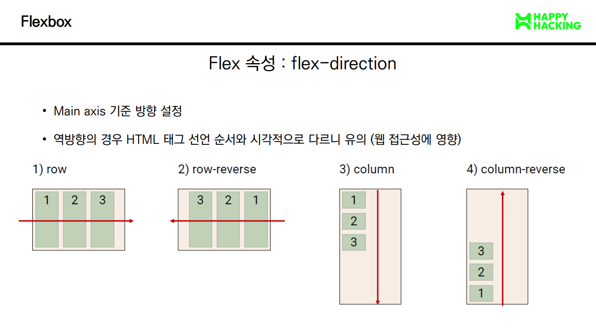
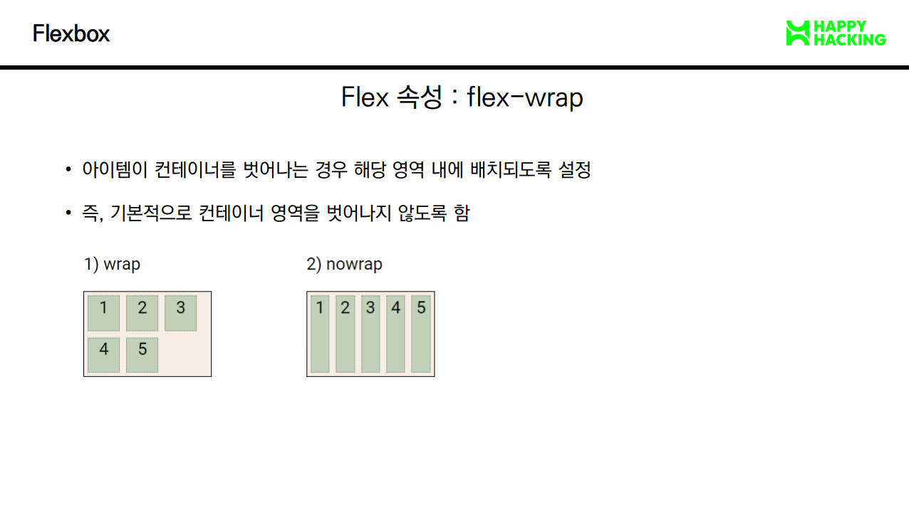
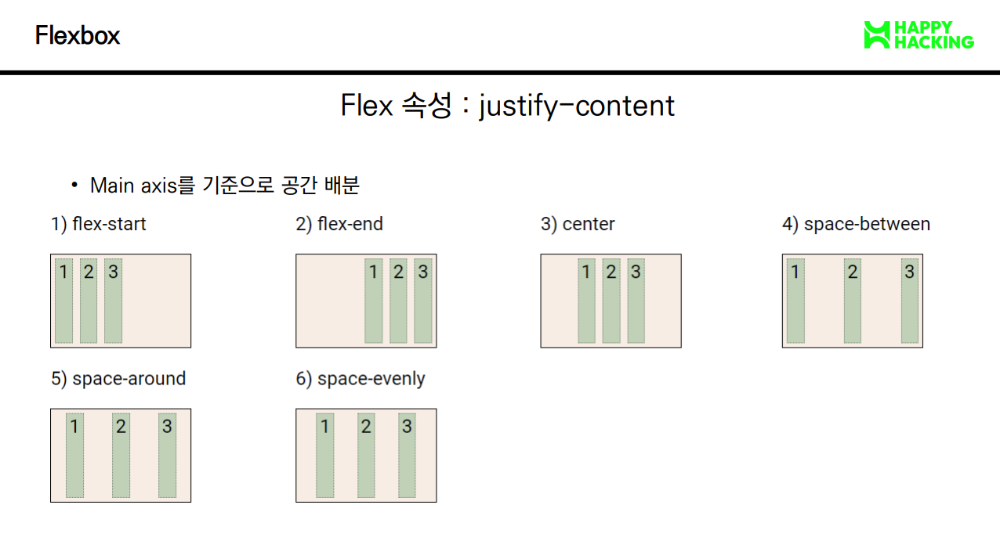
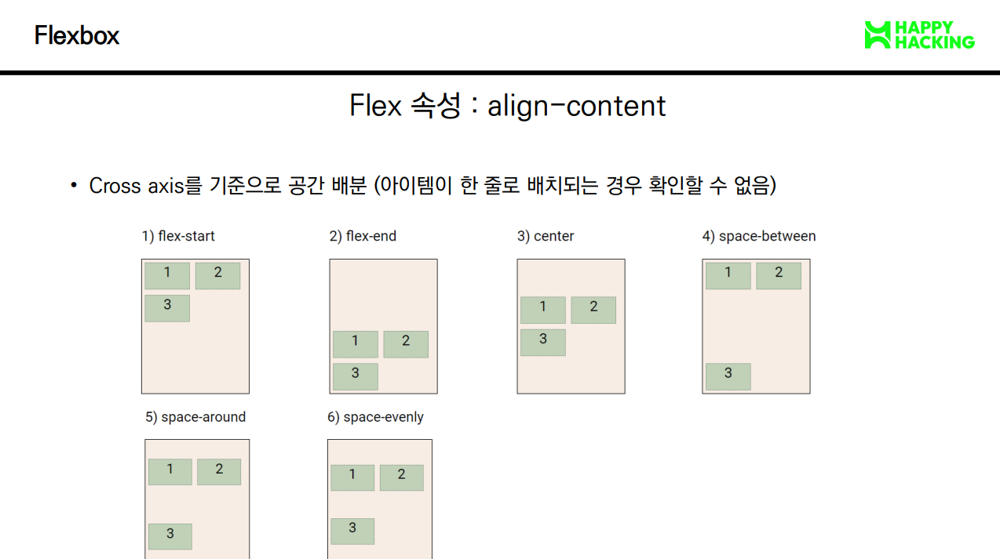
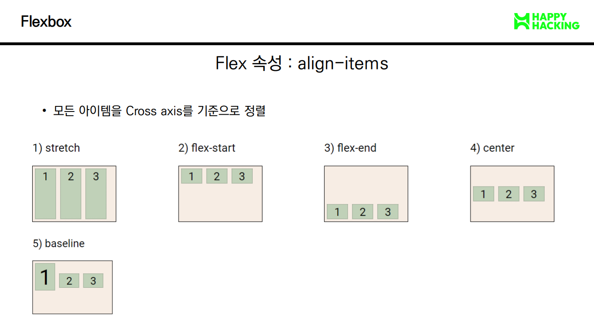
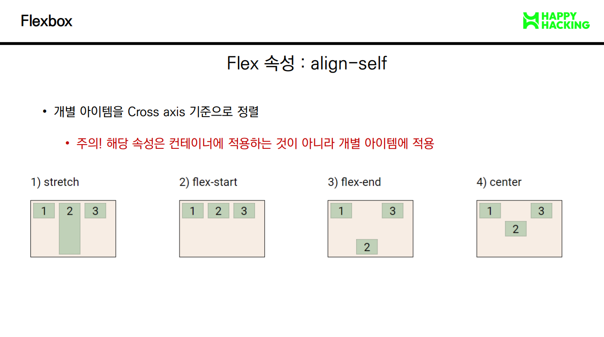

# 📚 0831 웹개발

## 📌 CSS Position
```javascript
// CSS position
  - 문서 상에서 요소의 위치를 지정
  
  - static: 모든 태그의 기본 값(기준 위치)
    - 일반적인 요소의 배치 순서에 따름(좌측 상단)
    - 부모 요소 내에서 배치될 때는 
      부모 요소의 위치를 기준으로 배치됨
  
  - 아래는 좌표 프로퍼티(top, bottom, left, right)를 
    사용하여 이동 가능
    1. relative: 상대 위치
      - 자기 자신의 static 위치를 기준으로 이동
        (normal flow 유지)
      - 레이아웃에서 요소가 차지하는 공간은 static일 때와 같음
        (normal position 대비 offset)
    
    2. absolute: 절대 위치
      - 요소를 일반적인 문서 흐름에서 제거 후
        레이아웃에 공간을 차지하지 않음
        (normal flow에서 벗어남)
      - static이 아닌 가장 가까이 있는 
        부모/조상 요소를 기준으로 이동
        (없는 경우 브라우저 화면 기준으로 이동)
    
    3. fixed: 고정 위치
      - 요소를 일반적인 문서 흐름에서 제거 후 
        레이아웃에 공간을 차지하지 않음
        (normal flow에서 벗어남)
      - 부모 요소와 관계없이 viewport를 기준으로 이동
        - 스크롤 시에도 항상 같은 곳에 위치함
    
    4. sticky: 스크롤에 따라 static -> fixed로 변경
      - 속성을 적용한 박스는 평소에 문서 안에서 position: static
        상태와 같이 일반적인 흐름에 따르지만 스크롤 위치가 
        임계점에 이르면 position: fixed와 같이 박스를
        화면에 고정할 수 있는 속성
      - 일반적으로 Navigation Bar에서 사용됨.

// fixed는 언제 쓸까요?
position: fixed 는 브라우저 기준으로 위치, CSS 기본 원칙인 좌측 상단에 배치되지 않음, 주로 브라우저를 기준으로 우측 하단에 위치

// CSS 원칙
- CSS 원칙 I, II: Normal flow
  - 모든 요소는 네모(박스모델), 좌측상단에 배치
  - display에 따라 크기와 배치가 달라짐

- CSS 원칙 III
  - position으로 위치의 기준을 변경
    - relative: 본인의 원래 위치
    - absolute: 특정 부모의 위치
    - fixed: 화면의 위치
    - sticky: 기본적으로 static이나 스크롤 이동에 따라 fixed로 변경
```

## 📌 CSS Layout
```javascript
// CSS layout techniques
- Display
- Position
- Float(CSS1, 1996)
- Flexbox(2012)
- Grid(2017)
- 기타
  - Responsive Wen Design(2010)
  - Media Queries(2012)

// Float
- 박스를 왼쪽 혹은 오른쪽으로 이동시켜 텍스트를 포함
  인라인요소들이 주변을 wrapping하도록 함

- 요소가 Normal flow를 벗어나도록 함

// Flexbox
- 행과 열 형태로 아이템들을 배치하는 1차원 레이아웃 모델

- 축
  - main axis(메인 축) // 가로
  - cross axix(교차 축) // 세로

- 구성 요소
  - Flex Container(부모 요소)
    - flexbox 레이아웃을 형성하는 가장 기본적인 모델
    - flex item들이 놓여있는 영역
    - display 속성을 flex 혹은 inline-flex로 지정

  - Flex Item(자식 요소)
    - 컨테이너에 속해 있는 컨텐츠(박스)

// 왜 Flexbox를 사용해야 할까?
이전까지 Normal Flow를 벗어나는 수단으로 Float 혹은 Position 등을 사용했으나 제약되는 부분이 존재했다. Flexbox의 경우 (수동 값 부여 없이)

1. 수직정렬
2. 아이템의 너비와 높이 혹은 간격을 동일하게 배치

가 가능하다는 장점이 있어 많은 빈도로 채택되고 있다.

// Flex 속성
- 배치 설정
  - flex-direction
    - Main axis 기준 방향 설정
    - 역방향의 경우 HTML 태그 선언 순서와 시각적으로 다르니 유의
      (웹 접근성에 영향)

  - flex-wrap
    - 아이템이 컨테이너를 벗어나는 경우 해당 영역 내에 배치되도록 설정
    - 즉, 기본적으로 컨테이너 영역을 벗어나지 않도록 함
    - ex)
      - nowrap(기본값): 한줄에 배치
      - wrap: 넘치면 그 다음 줄로 배치

  - flex-flow
    - flex-direction과 flex-wrap의 shorthand
    - flex-direction과 flex-wrap에 대한 설정 값을 차례로 작성
    - ex) flex-flow: row nowrap;

- 공간 나누기
  - justify-content(main axis를 기준으로 공간 배분)
  - align-content(cross axis를 기준으로 공간 배분)
  - ex)
      - flex-start(기본값): 아이템들을 axis 시작점으로
      - flex-end: 아이템들을 axis 끝 쪽으로
      - center: 아이템들을 axis 중앙으로
      - space-between: 아이템 사이의 간격을 균일하게 분배
      - space-around: 아이템을 둘러싼 영역을 균일하게 분배
                      (가질 수 있는 영역을 반으로 나눠서 양쪽에)
      - space-evenly: 전체 영역에서 아이템 간 간격을 균일하게 분배

- 정렬
  - align-items(모든 아이템을 cross axis 기준으로 정렬)
  - align-self(개별 아이템을 cross axis 기준으로 정렬)
    - 주의사항! 
      해당 속성은 컨테이너에 적용하는 것이 아니라 개별 아이템에 적용
  - ex) 
    - stretch(기본 값): 컨테이너를 가득 채움
    - flex-start: 위
    - flex-end: 아래
    - center: 가운데
    - baseline: 텍스트 baseline에 기준선을 맞춤

- 기타 속성
  - flex-grow: 남은 영역을 아이템에 분배
  - order: 배치 순서
```








