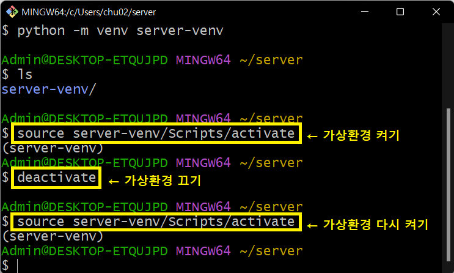
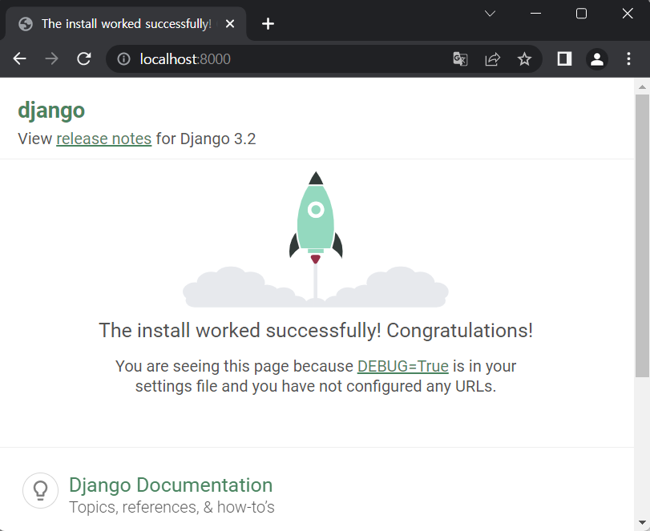

# ✅ Django 개발 환경 설정 가이드

- 가상환경 설정 및 활성화(실행)부터 Django 설치까지

  1. Git Bash 열기

     

  2. 작업하고 있는 경로 확인 (`pwd` 로 확인해보면 ~ 는 `/c/Users/[사용자이름]` 의미)

     

  3. 프로젝트 이름(ex. server)을 참고해서 작업할 폴더 생성

     

  4. 프로젝트 폴더 안에 가상환경 생성

     - `python -m venv [가상환경 이름] ` 
     - 가상환경 이름은 마음대로 작성해도 됨(`프로젝트이름-venv` 으로 이름짓기 추천)
     - 이렇게 가상환경(`server-venv`)을 만들고 프로젝트를 시작해야 이런저런 패키지를 설치해도 글로벌 영역이 망가지지 않음

     

  5. 가상환경 활성화(실행) 및 비활성화

     - (참고) 폴더명/파일명 대충 몇글자만 쓰다가 tab 누르면 나머지 이름 자동완성

     

  6. (가상환경 안에) Django (version 3.2.13) - LTS 설치

     - ⚠️ Django 설치 전, pip 버전 확인하고 업그레이드 하기!
  
       ```bash
       $ pip --version
       $ python -m pip install --upgrade pip
       ```
     - ⚠️`pip install django` 만 하면 가장 최신 버전(4.XX) 설치되니까 주의
     - 회사에서도 안정성 이슈 때문에 가장 최신 버전은 아마 안 쓸 것
     - (참고) LTS (Long Term Support, 장기 지원 버전)
       - 일반적인 경우보다 장기간에 걸쳐 지원하도록 고안된 소프트웨어 버전
       - 컴퓨터 소프트웨어의 제품 수명주기 관리 정책
       - 배포자는 LTS 확정을 통해 장기적이고 안정적인 지원을 보장

     

  7. django-admin 에게 프로젝트 셋업(생성) 해달라고 명령

     - `django-admin startproject [프로젝트 이름] [시작경로(현재폴더)] `

     

     

  8. 서버 돌리기
  
     
  
  9. (로컬 컴퓨터 내부에서) 서버 잘 돌아가고 있는지 확인
  
     - 브라우저 주소창에 `localhost:8000` 입력
       - `localhost` : 우리 주소, 커피숍(비유)
       - `8000` : 키오스크 혹은 직원 번호(비유)
     - 아래와 같이 django 가 기본적으로 준비한 페이지가 뜬다면 서버 작동이 정상적으로 확인된 것
  
     
  
  10. 가상환경을 삭제하고 싶다면?
  
      - 가상환경 만들어진 폴더를 삭제하거나
      - Git Bash 창에 `rm -r [가상환경 이름]/`
        - ex. `rm -r server-venv/`