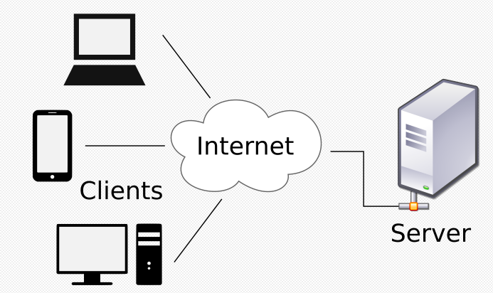

# ✅ 서버 기초

- 아래 MDN문서와 외부 자료를 조사해 주어진 질문의 답을 작성하세요.

## 📑 1. IP와 도메인은 무엇일까요?
  
### 1-1. IP
  -  네트워크에  연결되어 있는 각각의 장치를 호스트(HOST)라고 하며, 호스트는 다른 호스트와 데이터를 주고 받기 위해, 자신들을 구분하는 특수한 번호를 가지고 있는데 이것이 IP(Internet Protocol Address)주소이다. 여기서 프로토콜(Protocol)은 '상호간의 약속한 규칙'을 의미한다. (웹 브라우저 주소창에 보이는 http나 https의 p도, 서버에 파일을 업/다운로드 하기위해 접속하는 ftp의 p도 Protocol의 약자이다.)

  - IP주소 예시 : 127.0.0.1 (개인 로컬 IP 주소)

  -  IP주소는 4개의 숫자와 점(Dot)으로 구성되어 있으며, 각각의 숫자는 0~255 사이의 정수를 가진다.

  - IP주소 예시2 : http://localhost:3000
  
  - 웹 프로젝트 개발을 진행할 때, 자신의 컴퓨터를 서버로 설정하고 localhost로 접속하여 테스트를 하게 되는데 여기서 로컬호스트(Local Host)는 호스트 자기 자신을 가리키는 고유한 별칭이다.
    
### 1-2. 도메인
  - 도메인 예시 : https://www.naver.com

  - 위 인터넷 주소에서 'naver.com'을 도메인(Domain)이라고 한다. 우리가 문자열로 표현된 인터넷 주소로 웹사이트에 접속할 수 있는 것은, 웹 브라우저가 도메인과 연결되어 있는 IP주소를 찾아서 이동해주기 때문이다. 이것을 도메인 네임 시스템(DNS)라고 하고, 도메인과 IP의 연결 정보가 있는 서버를 네임 서버(Name Server)라고 한다. IP주소보다는 의미가 있는 문자열을 사용하는 것이 편리하기 때문에 도메인의 개념이 생겼다고 할 수 있다.

## 📑 2. 클라이언트와 서버는 무엇일까요?
  
  -  네트워크에  연결되어 있는 각각의 장치를 호스트(HOST)라고 하며, 우리가 흔히 말하는 서버(server)는 호스트가 자신에게 데이터를 요청(Request)했을 때, 이것을 응답(Response)하는, 즉 서비스를 제공하는 쪽의 호스트를 말한다. 클라이언트(Client)는 바로 이 데이터를 요청하는 쪽의 호스트이다.

  - 네트워킹(Networking)이란? 
  
    IT계열에서 네트워킹의 개념은 '두 대 이상의 컴퓨터를 케이블로 연결하여 네트워크를 구성하는것'을 네트워킹이라고 한다.

    현재에는 셀 수도 없을 만큼 많은 수의 컴퓨터가 인터넷이라는 하나의 거대한 네트워크를 구성하고 있고 인터넷을 통해 다양하고 방대한 양의 데이터를 공유하는 것이 가능해진 것👍🏼 이러한 네트워킹에 따라 메신저나 온라인게임과 같은 인터넷을 이용해 다양한 네트워크 어플리케이션이 많이 생겨난 것이다.

  - 클라이언트와 서버
  

### 2-1. 서버
  - 서버(server) 
  : 서비스를 제공하는 컴퓨터(service provider) 
다수의 클라이언트에게 서비스를 제공하기 때문에 고사양의 하드웨어를 갖춘 컴퓨터이지만, 하드웨어의 사양으로 서버와 클라이언트를 구분하는 것은 절대 아니며, 사양의 관계없이 서비스를 제공하는 소프트웨어가 실행되는 컴퓨터를 서버라고 한다.

### 2-2. 클라이언트
  - 클라이언트(client) 
  : 서비스를 사용하는 컴퓨터(service user) 
서버와 이어진 모든 기기(컴퓨터의 경우 WIFI / 모바일은 모바일 네트워크)와 단말기에서 이용하는 웹에 접근하는 SW이며, 주로 서버에 요청을 보내고 응답을 받는 역할을 한다.

### 2-3. 서비스
  - 서비스(Service)
  : 위에서 본 것 처럼 서버는 클라이언트로부터 요청을 받아 응답을 내려주고 클라이언트는 서버에 데이터를 요청하고 응답을 받는다. 재화와 서비스의 개념에서 가져와 서비스라고 일컫는다. 서비스의 종류에 따라 파일 서버/메일 서버/어플리케이션 서버 등으로 나눠진다.

### 2-4. 서버와 클라이언트는 어떻게 연결하지?
  - 앞에서 보았던 개념처럼, 서버가 서비스를 제공하기 위해서는 서버 프로그램이 있어야하고, 클라이언트가 서비스를 제공받기 위해서는 서버 프로그램과 연결할 수 있는 클라이언트 프로그램이 존재해야 한다. 
  
### 2-5.  그러면 연결하는 방식은 한가지뿐인가? 기본적으로 서버 프로그램을 따로 두는지 또는 하나로 합친것인지 나뉜다.

  - 서버기반 모델(server-based model) : 전용서버를 두는 것
  - 안정적인 서비스 제공 가능
  - 공유 데이터의 관리와 보안이 용이
  - 서버구축비용과 관리비용이 든다는 단점
  P2P 모델(peer-to-peer model) : 별도의 전용 서버없이 각 클라이언트가 서버역할을 동시에 수행하는 것
  - 서버구축 및 운용비용을 아낄 수 있는 장점
  - 자원의 활용을 극대화 할 수 있음
  - 자원의 관리가 어려움
  - 보안이 취약하다는 단점

### 2-6. 웹서비스에 대해서 조금 더 자세히
  - 웹 서버(Web Server) : 웹 서버에 각종 정보를 담은 웹 페이지를 저장한 후 이러한 서버의 웹 페이지를 요청하는 클라이언트에게 제공한다. 구글, 네이버 등 수많은 회사들이 웹 서버를 만들어 웹서비스를 제공하고 있다.
  - 웹 브라우저(Web browser) : 웹서비스 사용자는 웹 브라우저라는 전용 클라이언트 어플리케이션으로 웹 서버가 제공하는 서비스를 이용한다. 웹 브라우저가 웹 서버에게 필요한 페이지를 요청하면 웹서버가 이에 대해 응답해 웹페이지를 보내주고 웹 브라우저가 이 웹페이지를 받아 사용자에게 보여주는 역할

## 📑  3. 정적 웹 사이트와 동적 웹 사이트의 차이점은 무엇일까요?

### 3-1. 정적 웹 사이트
  - 서버에 미리 저장된 파일이 그대로 전달되는 웹 페이지 서버는 사용자가 요청에 해당하는 저장된 웹 사이트를 보낸다. 사용자는 서버에 저장된 데이터가 변경되지 않는 한 고정된 웹 사이트를 보게 된다.

  - 장점
    - 빠르다: 요청에 대한 파일만 전송하면 되기 때문에 추가적인 작업 X
    - 비용이 적다: 마찬가지로 웹 서버만 구축하면 됨
  
  - 단점
    - 서비스가 한정적이다: 저장된 정보만 보여줄 수 있음
    - 관리가 힘들다: 추가/수정/삭제의 작업 모두 수동

### 3-2. 동적 웹 사이트
  - 서버에 있는 데이터들을 스크립트에 의해 가공처리한 후 생성되어 전달되는 웹 페이지 서버는 사용자의 요청(Request)을 해석하여 데이터를 가공한 후 생성되는 웹 사이트를 보낸다. 사용자는 상황, 시간, 요청 등에 따라 달라지는 웹 사이트를 보게 된다.

  - 장점
    - 서비스가 다양하다: 다양한 정보를 조합하여 동적으로 생성하여 제공
    - 관리가 쉽다: 웹 사이트 구조에 따라 추가/수정/삭제 등의 작업 용이

  - 단점
    - 상대적으로 느리다 : 사용자에게 웹 페이지를 전달하기 전에 처리하는 작업이 필요
    - 추가 비용이 든다 : 웹 서버 외에 추가적으로 처리를 위한 어플리케이션 서버가 필요 

### 3-3. 웹 사이트에 대해서 조금 더 자세히
  - 동적 웹 사이트는 정적 웹 사이트와는 달리 서버 내부에서 추가적인 작업이 필요하기 때문에 서버 내부에 그런 작업들을 처리하기 위한 모듈 같은 것이 필요하다. 설치형 사이트인 워드프레스의 경우를 보더라도 PHP와 MySQL를 요구한다. 스크립트 처리기(PHP)와 데이터베이스(MySQL)입니다. 따라서 서버를 구성하실 때 해당 모듈을 설치해야 하며, 웹 호스팅을 이용할 때도 해당 모듈들을 제공하는 서비스를 선택해야 한다(대부분의 웹 호스팅은 PHP와 MySQL)를 제공하지만 요구 버전 등이 있으니 확인해야 한다. 이런 모듈들은 서버의 자원(CPU, 메모리 등)을 이용하기 때문에 비용에 속한다. 이런 모듈들을 이용해서 동적 웹 페이지를 생성한다는 것 자체가 당연히 바로 전송하는 것보다 느리며 이런 부분도 비용에 해당한다. 
  
  - 하지만 웹 사이트 구축과 운영/관리 측면에서 보면, 구조화된 웹사이트 구축과 관리의 용이성 때문에 전체적인 비용이 절감된다고 볼 수 있다. 정적 웹 페이지는 각각 독립되어 있기 때문에 같은 코드가 포함된다 해도 각각 따로 저장되어야 하지만(iframe 등의 태그 이용 제외), 동적 웹 페이지는 중복 코드는 하나의 파일로 만들어서 스크립트로 불러오기가 가능하다. 따라서 구조화된 웹 사이트를 구축할 수 있으며, 수정 또한 정적 웹 페이지는 각각 페이지를 수정해줘야 하지만, 동적 웹 페이지는 공통된 부분 한번만 수정을 해서 전체 웹 사이트가 수정되는 효과를 가져올 수 있다.

  - 그렇다고 모든 페이지를 동적 웹 페이지로 구성하고 정적 웹 페이지를 전혀 사용하지 않는 것은 아니다. 자주 변경되지 않은 페이지(About과 같은)의 경우는 굳이 동적 웹 페이지로 만들 필요는 없다. 그리고 최근에는 정적 웹 페이지의 적은 비용이라는 장점을 이용하는 방법도 많이 사용된다. 정적 웹 페이지 생성기를 통해서 정적 웹 페이지로만 이루어진 블로그 등이 있다. 자신의 웹 사이트의 성격에 맞게, 각각 페이지 특성에 맞게 정적과 동적 웹 페이지를 적절하게 섞어서 사용하면 된다.

## 📑  4. HTTP는 무엇이고 요청과 응답 메시지 구성은 어떻게 되나요?

### 4-1. HTTP
  - HTTP는 HyperText Transfer Protocol(하이퍼텍스트 트렌스퍼 프로토콜)의 줄임말이다.
  
  - HTTP는 HTML과 같은 문서를 전송하기 위한 Application Layer Protocol (애플리케이션 계층 프로토콜)이다.
  
  - HTTP는 웹 브라우저와 웹 서버의 소통을 위해 디자인되었다.

  - HTTP의 특징 1 - Stateless(무상태성)
    : HTTP는 특정 상태를 유지하지 않는 특징이 있다.
  
  - HTTP의 특징 2 - Connetionless(비연결성)
    : HTTP는 실제로 요청을 주고 받을 때만 연결을 유지하고 응답을 주고나면 서버와의 연결을 끊는다.

  - HTTP 메시지는 서버와 클라이언트 간에 데이터가 교환되는 방식이며, 메시지 타입은 두 가지가 있다. 요청(request)은 클라이언트가 서버로 전달해서 서버의 액션이 일어나게끔 하는 메시지고, 응답(response)은 요청에 대한 서버의 답변이다.

### 4-2. HTTP 요청과 응답의 구조
  - HTTP 요청과 응답의 구조는 서로 닮았으며, 그 구조는 다음과 같다.
    
    1. 시작 줄(start-line)에는 실행되어야 할 요청, 또은 요청 수행에 대한 성공 또는 실패가 기록되어 있습니다. 이 줄은 항상 한 줄로 끝납니다.

    2. 옵션으로 HTTP 헤더 세트가 들어갑니다. 여기에는 요청에 대한 설명, 혹은 메시지 본문에 대한 설명이 들어갑니다.

    3. 요청에 대한 모든 메타 정보가 전송되었음을 알리는 빈 줄(blank line)이 삽입됩니다.

    4. 요청과 관련된 내용(HTML 폼 콘텐츠 등)이 옵션으로 들어가거나, 응답과 관련된 문서(document)가 들어갑니다. 본문의 존재 유무 및 크기는 첫 줄과 HTTP 헤더에 명시됩니다.

<참고문서>
https://hanamon.kr/%EB%84%A4%ED%8A%B8%EC%9B%8C%ED%81%AC-http-%EB%A9%94%EC%84%B8%EC%A7%80-message-%EC%9A%94%EC%B2%AD%EA%B3%BC-%EC%9D%91%EB%8B%B5-%EA%B5%AC%EC%A1%B0/

## 📑 5. 프레임워크는 무엇일까요?

### 5-1. 프레임워크
  - 프레임워크란 '소프트웨어의 구체적인 부분에 해당하는 설계와 구현을 재사용이 가능하게끔 일련의 협업화된 형태로 클래스들을 제공하는 것'

### 5-2. 프레임워크
  - 라이브러리란 '자주 사용되는 로직을 재사용하기 편리하도록 잘 정리한 일련의 코드들의 집합'을 의미한다. 비유하자면 프레임워크는 자동차의 프레임, 라이브러리는 자동차의 기능을 하는 부품을 의미한다.

### 5-3. 프레임워크의 장, 단점
  - 장점
    1. 효율적
      : 코드를 일일이 짜는 것보다 시간과 비용이 절약되어 생산성 향상
    
    2. Quality 향상
      : 버그 발생 가능성을 처리해줌으로써 개발자가 반복 작업에서 실수하기 쉬운 부분을 커버해준다. 다수의 개발자가 사용하며 수정하다 보니 이미 검증된 코드라고 볼 수 있다.
    
    3. 유지 보수 Good!
      : 프레임워크를 쓰지 않고 일일이 코드를 짜 놓은 경우, 회사 입장에서 개발 담당자가 바뀌어버리면 곤란해진다. 그러나 Framework를 사용하면 코드가 보다 체계적이어서 담당자가 바뀌더라도 위험부담을 줄일 수 있으며 유지 보수에 안정적이다.
  
  - 단점
    1. 학습시간이 길다
      : 코드를 본인이 짜 놓은 것이 아니기 때문에, 프레임워크에 있는 코드를 습득하고 이해하는 데 오랜 시간이 걸립니다.
    
    2. 제작자의 의도된 제약 사항
      : 제작자가 설계한 구조를 어느 정도 유지한 채 코드에 살을 붙여나가야 한다. 따라서 개발자는 자유롭고 유연하게 개발하는 데 한계가 있다.

### 5-4. 프레임워크 더 알아보기
  - 프레임워크는 단점이 존재하지만 단점을 커버할 수 있을 만한 좋은 장점이 있습니다. 개발의 상황과 목적에 맞는 프레임워크를 잘 파악하여 선택한다면 시간과 비용을 줄이는 것은 물론이고 코드의 품질이 훌륭한 개발을 할 수 있을겁니다.

<참고문서> 
https://www.castingn.com/sourcing/kkultip_detail/110
https://moolgogiheart.tistory.com/87

## 📑 기타
<웹 추천 영상>
https://www.youtube.com/watch?v=PUPDGbnpSjw