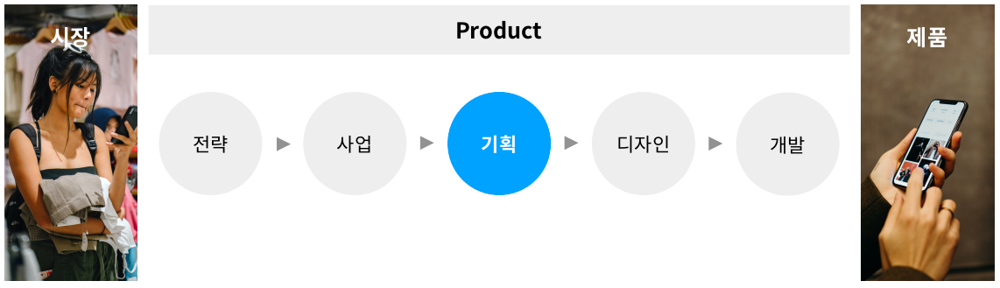
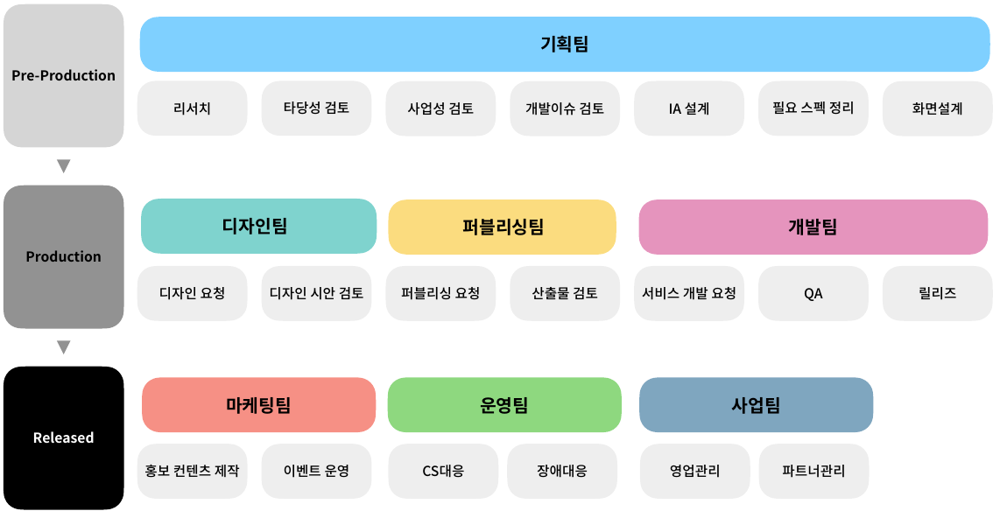

# 📚 제로베이스 서비스 기획서 온라인 완주반

## 📌 Chapter 01. 서비스 기획 첫걸음

### ✔ 서비스 기획이란?
사용자들이 겪고 있는 문제를 발굴하고 이를 해결하기 위해 필요한 모든 과정을 설계하는 것


### ✔ 프로젝트 프로세스


### ✔ 프로젝트 진행 프로세스

|순서|프로젝트 진행 프로세스|내용|예시|
|--|--|--|--|
|1|Pre-Production|제품 및 서비스를 설계하는 단계|집을 설계하는 과정 <br> 설계도 제작 과정|
|2|Production|제품 및 서비스를 개발하는 단계|집을 짓는 과정|
|3|Released||완성된 집 안에 어떤 인테리어를 할 것인지, <br> 어떤 가구를 배치할 것인지|

<Pre-Production 진행과정>
1. 리서치
  <BR>=> 문제해결을 위한 원인 분석 및 
  해결방안 검토를 위한 자료조사 단계
  <br>
  (1) 내부 리서치
  <BR>- 로그 데이터, A/B 테스트, VOC, 사용성 테스트, 사용성 벤치마킹, 데이터 마이닝
  <br>
  (2)외부 리서치
  <BR>- 사용자 서베이, FGU인터뷰, 벤치마킹, 온라인자료조사, 리서치업체, 데이터 마이닝

2. 타당성 검토
  <BR>=> 조사된 자료를 기반으로 해결방안을 설계하고 
  상위 기획서를 작성하는 단계

3. 필요 스펙 정리
  <BR>=> 해결방안에 대한 구현방식 및 목표를 설정하고 
  해당 목표를 달성하기 위한 스펙 정리 단계

4. 사업성 검토
  <BR>=> 사업관련 부서와의 사업성 검토 및 스펙초안 확정 단계
  <BR>- 사용자 VOC 분석
  <BR>- 클라이언트 요구사항 컴토
  <BR>- 사내 타 서비스와의 카니발리제이션 여부 검토
  <BR>- 내부자산 활용 방안 검토
  <BR>- 서비스 패키징 가능여부 검토

5. IA(Information Archtecturing) 설계
  <BR>=> 협의된 스펙을 바탕으로 메뉴를 분류하여 Depth 구조로 설계
  <BR>1) 서비스 플로우
  <BR>2) 컨텐츠
  <BR>3) 커뮤니케이션

6. 개발이슈 검토
  <BR>=> 논의된 스펙에 대한 서비스 구현 가능성 및 적합성 검토 단계
  <BR>- 스펙초안 리뷰
  <BR>- 기능 구현 가능여부(가장 중요한 부분!)
  <BR>- 구현방향 논의
  <BR>- 추가 검토 필요사항 전달
  <BR>- 리소스 할당(개발기간 설정, 개발인원 배정, 담당자 지정 등)

7. 화면설계
  <BR>=> 구체적인 서비스의 동작, 정책 등을 정의하고 이에 대한 상세 기획서 작성 단계
  <BR>- 상세기획서 구성요소
  <BR>1) 표지 및 목차(프로젝트 관련 기본내용)
  <BR>2) 히스토리(기획서 버전관리)
  <BR>3) 사이트맵(서비스 전체구조 시각화)
  <BR>4) 화면목록(기획서 내 페이지별 컨텐츠 정리)
  <BR>5) 상세 설계(플로우차트, 정책정의서, UI/UX 설계)

<Production 진행과정>
1. 기획서 리뷰
  <BR>=> 상세기획서 작성 완료 후 관련 부서 전체에 공유하는 단계

2. 리소스 할당
  <BR>=> 서비스 개발을 위해 각 부서 담당자 배치를 할당받는 단계
  <BR>- 기획서 리뷰 및 리소스 할당 시
  <BR>1) 스펙 상세 리뷰
  <BR>2) 기능 구현 가능여부 검토요청
  <BR>3) 담당자 지정 요청
  <BR>4) 기능 구현에 대한 의견 청취
  <BR>5) 일정 산정 

3. 디자인 요청
  <BR>=> 상세기획서 내용을 기반으로 서비스 디자인을 제공받으며 시안을 기준으로 수정사항 확인 및 반영하는 단계
  <BR>1) 디자인 컴포넌트 확정
  <BR>2) 디자인 시안 검토
  <BR>3) 디자인 가이드라인 공유
  <BR>4) 인터랙션 재검토

4. 퍼블리싱 요청
  <BR>=> 디자인 시안을 바탕으로 마크업 작업을 요청하는 단계
  <BR>1) UX/UI 요소 구현
  <BR>2) 테스트페이지 요청
  <BR>3) 디자인 반영내역 검토
  <BR>4) 반응 웹 반영 검토

5. 개발 요청
  <BR>=> 기획서 스펙사항을 서비스에 반영하는 단계
  <BR>1) FE-BE 간 커뮤니케이션
  <BR>2) 테스트 단계 수립
  <BR>3) 개발 일정 조율(가장 중요한 부분!)
  <BR>4) 변경내역 검토 및 조율

6. QA(Quality Assurance)
  <BR>=> 개발이 완료된 내용에 대해 품질 검증을 위한 테스트를 진행하는 단계
  <BR>1) TC(Test Case) 제작
  <BR>2) 잔존결함 발견 및 수정요청
  <BR>3) 릴리즈 일정 조율

7. 릴리즈(Released)
  <BR>=> 사용자에게 서비스를 오픈
  <BR>1) 사전 공지
  <BR>2) 약관 검토
  <BR>3) 앱 심사 요청
  <BR>4) 릴리즈 대기
  <BR>5) 회고

### ✔ 서비스 기획 방법론
1. 워터폴 방법론
  <BR>=> 각 단계가 위에서 아래로 물이 떨어지듯 순차적으로 진행되며, 정해진 일정에 맞춰 각 단계가 진행되는 방법론

2. 애자일 방법론
  <BR>=> 프로젝트의 반복주기를 작게 나누며 각 반복주기의 결과물을 측정, 지속적으로 각 주기를 평가하는데 사용하는 방법론

### ✔ 기본용어 알아보기

1. FE vs BE 
- FE(Front-End)
  <BR>: 사용자에게 클라이언트를 통해 다양한 콘텐츠를 제공하고, 사용자의 인풋에 반응하여 동작하는 영역
- BE(Back-End)
  <BR>: DB(Data Base)를 저장하고 관리하며, 클라이언트의 요청에 따라 정보를 내려주는 역할을 하는 영역

2. 리서치
- 벤치마킹
  <BR>: 경쟁사나 특정 분야에서 좋은 성과를 보이는 상대를 표적으로 현황 및 성과 차이를 비교하는 분석

- FGI(Focus Group Interview)
  <BR>: 정성조사의 한가지 방법으로 조사진행자가 소수의 조사 대상자들을 한 장소에 모아 인터뷰를 진행함

- 로그
  <BR>: 서비스 내에 발생하는 모든 동작과 이벤트에 따른 정보를 시간에 따라 남기는 데이터

- 대시보드
  <BR>: 서비스 혹은 서비스 간 다양한 데이터를 동시에 비교할 수 있게 해 주는 여러 뷰의 모음

- 데이터 트래킹
  <BR>: DB(Data Base)에 저장된 데이터를 다양한 툴을 활용하여 추출하는 업무

- 페르소나
  <BR>: 어떤 제품이나 서비스를 사용할만한 목표 연구 집단 안에 있는 다양한 사용자 유형을 대표하는 가상의 인물

3. 프로젝트 관리
- KPI(Key Performance Indicator)
  <BR>: 목표를 성공적으로 달성하기 위해 핵심적으로 관리해야 하는 요소들에 대한 성과지표

- 로드맵
  <BR>: 구체적인 이행 목표를 세운 뒤 목표달성을 위해 작성된 가이드라인

- 마일스톤
  <BR>: 프로젝트 진행 과정에서 특정할만한 건이나 표를 뜻하며 주로 진행상황 체크를 위해 설정

- 리소스
  <BR>: 프로젝트 달성을 위해 필요한 자원을 뜻하며 주로 프로젝트 참여 인원의 참여 가능범위를 지칭하는 용도로 사용

- 리뷰
  <BR>: 완성된 기획서 등의 문서를 프로젝트 참여인원에게 공유하는 자리

- 회고
  <BR>: 프로젝트가 마무리된 이후 참여인원들과 프로젝트 진행에 대한 의견을 교환하는 자리

4. 서비스 기획
- IA(Information Architecture)
  <BR>: 정보구조도 주로 서비스 전체 아웃라인을 조망하기 위하여 사용

- 와이어프레임
  <BR>: 서비스의 레이아웃을 구상하는 초안단계에서 주로 서비스 플로우를 집중적으로 확인하기 위해 작성하는 화면

- 상세기획서
  <BR>: 스토리보드를 중심으로 페이지 구성과 기능, 정책 등 서비스와 관련된 모든 내용을 담은 최종 산출물인 기획서

- 플로우차트
  <BR>: 특정 기능 혹은 서비스 플로우의 흐름을 특정한 순서도 기호를 사용하여 도식적으로 표현한 다이어그램

- 어드민
  <BR>: 서비스 운영을 위한 관리자 페이지이며 운영에 필요한 권한관리, 통계 등의 기능에 제공되는 페이지
  
## 📌
```javascript

```

## 📌
```javascript

```