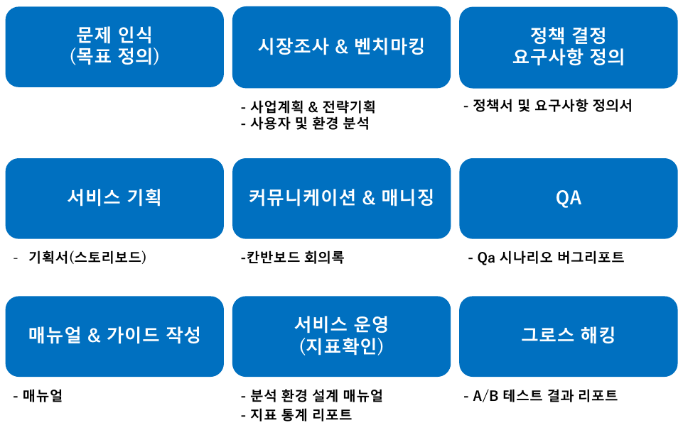
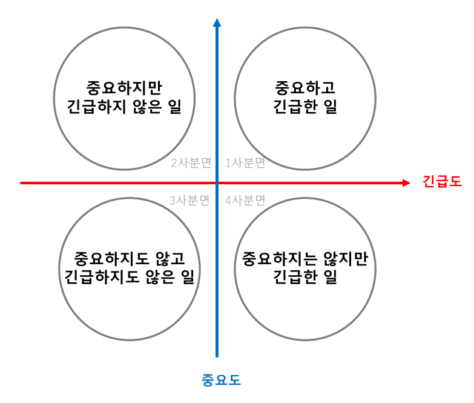

# 📚 제로베이스 서비스 기획서 온라인 완주반

## 📌 Chapter 02. 서비스 기획자, PM, PO는 왜 필요한가

### ✔ 인터넷 서비스의 역사와 기획자의 역할

서비스 기획자 vs Product Manager vs Product Owner

### ✔ 서비스 기획자가 하는 일

영화감독
 : 영화라는 매개체를 통해서 사용자에게 시대에 따라 변화하는 사용자가 듣고 싶어하는 메시지를 전달

기획자
 : IT기술을 통해서 사용자의 문제를 해결

서비스 목표 -> 서비스 기획자 -> 프로젝트 구성원 -> 피드백
 => 해당 과정 끊임없이 순환

### ✔ 목표를 잡고, 우선순위를 정하는 법

OKR(Objective, Key Result): 목표, 성과 지표

|OKR|KPI|
|--|--|
|개인, 팀 및 모든 조직과 자유롭게 연결된 전략| 개인, 팀 간에 상/하위로 일치된 전략|
|회사의 목표를 달성하기 위해 무엇이 중요한지 모두에게 알림|전체 전략을 각 부서의 운영 활동 및 접근방법을 모색|
|나타난 결과치보다는 결과의 이유에 집중|나타난 결과치에 보다 집중|
|공격적인 목표치를 설정|달성가능한 목표치 설정|
|역할에 맞게 명확한 커뮤니케이션을 할 수 있는 프레임워크|조직 성과와 연계|
|상향식 및 하향식 - 50/50|리더십 주도-하향식|
|성장지향|성과 관리 중점|

OKR의 특징
1. 전사적 목표 일치
2. 도전적 목표 설정
3. 투명한 목표 공유
BUT, 인사평가를 OKR로 하면 안됨. 목표를 낮게 잡게 됨

> 우선순위 정하는 법1

Reach
 :도달 범위, 특정 기간에 해당 기능을 사용할 수 있는 사용자 수

Impact
 : 고객에게 줄 수 있는 영향력(매우 큰, 적당히 높음 등)

Confidence
 : 신뢰도 기획자가 생각하는 해당 기능에 자신감

Effort
 : 개발, 기획, 디자인 리소스

> 우선순위 정하는 법2

Must Have
 : 꼭 만들어야 하는 기능으로 법적, 보안적 이슈 및 서비스의 핵심을 위해서 꼭 구현해야 하는 기능

Should have
 : 우선순위는 높지만, 이것이 없어도 큰 문제는 아닌 기능

Could have
 : 있으면 좋은 기능

Won't have
 : 이번에는 만들지 않을 기능

> 우선순위 정하는 법3

