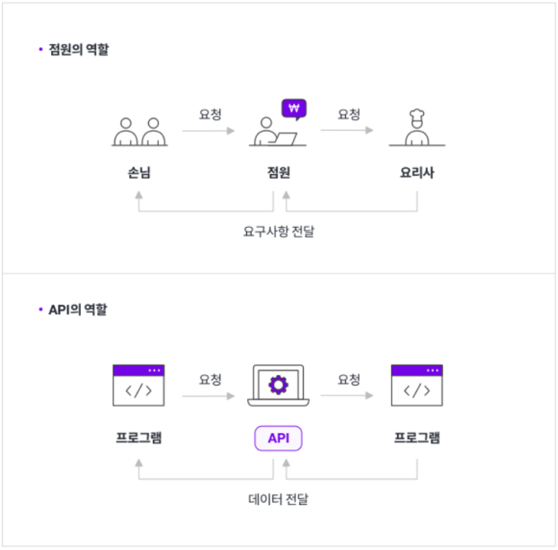
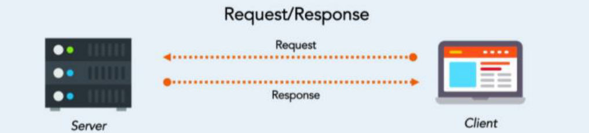

# 📚 제로베이스 서비스 기획서 온라인 완주반

## 📌 Chapter 03. 서비스 기획자에게 꼭 필요한 스킬셋
- 프로덕트 성공을 위해 필요한 스킬셋
 1) 사용자와 제품에 대한 이해
 2) 비즈니스 및 사업 모델에 대한 깊은 이해
 3) 동료들로부터 신뢰를 형성하고, 리드할 수 있는 능력

- 서비스 기획 실무를 위해 필요한 스킬셋
 1) IT서비스 개발 업무를 협업하기 위한 도메인 지식
 2) 성과를 달성하기 위한 아이디어 도출 능력
 3) 데이터를 이용해서 결과치를 뽑아내고 분석할 수 있는 능력

- 모든 업무의 기본
 : 논리적 사고와 커뮤니케이션 능력

### ✔ 1. 사용자와 제품에 대한 이해
- 복잡성 보존의 법칙
 : 어떠한 일을 수행할 때 더이상 줄일 수 없는 필수적인 복잡성이 정해져 있으며,  사용에 있어서 이 법칙은 복잡함을 누가 부담하느냐의 문제이다.
   아마존과 야후에서 사용자 인터페이스 최고책임자로 일했던 레리 테슬러

- 어려운 금융에 대한 쉽고 편한 UI, UX제공하면서 소비자에게 성공한 서비스
 ex) 은행점검시간에 입, 출금이 불가한 부분을 예약송금 기능으로 해결
 ex) 마켓컬리 샛별배송의 성공  - 빨리가 아닌 '내가 집에 있는 시간', '내가 예측 가능한 시간' 배송

### ✔ 2. 비즈니스 및 사업 모델에 대한 깊은 이해 

- 당근마켓의 경우, 판교장터라는 초기모델(판교에 국한)로 시작해 사업성을 확인한 후 전국 지역별로 거래할 수 있는 현재의 당근마켓으로 사업영역 확장
- 매너온도 등 게이밍요소 추가로 사용자 추가 유입

### ✔ 3. 동료들로부터 신뢰를 형성하고, 리드할 수 있는 능력

- Product Manager(PM)
 : 내가 개인적으로 아는 PM들은 모두 훌륭하신 분들이다. 제품의 비젼도 뛰어나고 기획도 훌륭하게 해내는 분들이시다. 하지만 많은 PM들이 정보전달자에 지나지 않는 경우가 많다. 그럼에도 불구하고 이런 PM들조차도 대부분 사내에서 영향력들이 뛰어나다. 그 이유가 바로 PM들이 information flow를 컨트롤하고 있기 때문이다. 이게 생각보다 무섭다. PM까지 갈 필요도 없다. 친구들끼리 여행을 간다고 해도 그 안에서 가장 영향력 있는 사람은 대부분 그 여행은 arrange하고 모든 예약과 administration을 해서 정보전달의 key를 쥐고 있는 사람이다. 이래서 많은 PM들이 영향력을 높히기 위해 팀을 쪼개서 미팅도 많이 잡고 여러 node의 inforamtion flow를 컨트롤하려고 한다. 여하튼 이런 이유로 우리팀의 PM을 내편으로 만들면 information을 이용해 프로젝트의 task를 만들고 분배하는 부분에 영향력을 끼쳐 우리 팀으로 중대업무를 모두 돌릴 수 있을 것이라 생각했다.

- PM의 3가지 능력(from. 강남언니)
  - 극도의 투명함(Radical Transparency)
   : 단순히 결과가 잘 공유되는 것 이상을 의미하며, 결과뿐 아니라 의도와 맥락, 과정까지도 알 수 있을만큼 공유하는 것

  - 극도의 솔직함(Radical Honesty)
   : 우리가 서로에게 얼마나 솔직할 수 있는가는 상호 신뢰와 존중의 척도

  - 극도의 협업(Radical Collaboration)
   : 분업과 협력을 포함한 여러 도구를 사용해서 하나의 목적을 함께 달성하고자 하는 것 그 자체

### ✔ 4. IT 서비스 개발 업무를 협업하기 위한 도메인 지식

- 프론트엔드
  - 웹
  - 모바일웹(반응형)
  - PC앱
  - 하이브리드
  - 네이티브(운영체제 전용)
    - IOS
    - 안드로이드

- 백엔드
  - API(Application Programming Interface)
  
    - API의 종류
    1) private API
    2) partner API
    3) public API
  - 네트워크
  - 서버

- Request & Response

- Request의 종류(CRUD)
  - Create = POST
      서버에 정보를 올려달라는 요청
      POST 메서드를 사용해 요청함
      POST를 통해 해당 URI를 요청하면 리소스를 생성함
  - Read = GET
      서버에서 정보를 불러오는 요청
      GET 메서드를 사용해 요청함
      GET을 통해 해당 리소스를 조회, 해당 도큐먼트에 대한 자세한 정보를 가져옴
  - Update = PUT, PATCH
      정보를 바꾸는 요청
      PUT 혹은 PATCH 메서드를 사용해 요청
      PUT은 데이터 전체를 바꾸고 싶을 때, PATCH는 데이터의 일부만 수정하고 싶을 때 사용
  - Delete = DELETE
      정보를 지우는 요청
      DELETE 메서드를 사용해 요청함
      DELETE를 통해 리소스를 삭제할 수 있다.

### ✔ 5. 성과를 달성하기 위한 아이디어 도출 능력

### ✔ 6. 데이터를 이용해서 결과치를 뽑아내고 분석할 수 있는 능력

- 데이터를 이용해 어떤 시장에 먼저 진입할지 분석하는 능력
- 기획자가 중요하게 봐야하는 데이터 2가지
  - 컨버젼 레이트(CVR)
     : 고객이 우리 서비스에 들어오면서부터 우리가 원하는 행동으로 하나씩 전환하는 비율
      전환율: 구매전환율, 회원가입전환율, 특정 행동 전환율 등
      EX) 오바마 대통령의 대선 캠프
      - 20개월동안 500회의 AB테스트를 수행
      - 기부 전환율을 49%, 가입 전환율을 161% 상승
      - 지속적인 AB테스팅을 위해 5개의 AB테스팅을 항상 준비

  - 코흐트(Cohort retention) 리텐션
     : 동일 기간에 특정 이벤트를 함께 경험한 동일군의 유저 or 특정 행동 성별 등의 특징으로 고객군을 나누어서, 그 고객 군에 따른 우리 서비스에 다시 들어오는 비율을 추적하는 것

### ✔ 7. 논리적 사고와 커뮤니케이션 능력

- 논리적 사고
  - MECE METHOD
   : 서로 중복되지 않으면서 전체적으로 누락이 없도록 한다
    - MUTUALLY
    - EXCLUSIVE
    - COLLECTIVELY
    - EXHAUSTIVE

  - MECE METHOD의 장점
    - 명료함
    - 빠지는 것 없이 꼼꼼하게 고려가능
    - 설득력 향상

- 커뮤니케이션 능력
  - 두괄식으로 말하기
  - 문서 커뮤니케이션
    - 아마존의 6페이지 글쓰기 원칙
     : 소개, 목표, 원칙, 비즈니스 상태, 교훈, 전략적 우선순위
    
    - 아마존 CEO가 6페이지 문서 작성법을 택한 3가지 이유
      1) 인간의 뇌는 항목별로 정리한 요약 글보다 서술형으로 작성한 글에 더 적합하다.
      2) 이야기가 슬라이드보다 설득력 있는 도구라는 점이다.
      3) 파워포인트 특유의 '글머리 기호'정리 방식이 아이디어를 공유하는 데 가장 비효율적인 수단이라는 점이다.
