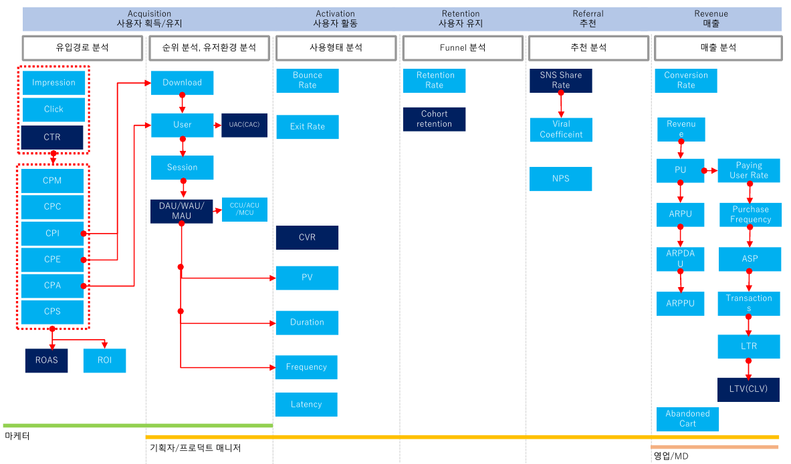

# 📚 제로베이스 서비스 기획서 온라인 완주반

## 📌 Chapter 05. 그로스 해킹

### ✔ 1. Growth hacking이란?
- Growth hacking
 : 사전적 의미대로 해석하면 경작해서 성장하다라는 의미로 풀이할 수 있다. 이는 곧, 기존에 없던 시장을 창조하고 고객을 발굴(경작)하고 키워낸다는 것을 의미한다. 불특정 다수를 대상으로 비효율적인 마케팅 광고를 집행하기보다는 자신들의 목적에 최적화된 고객을 발굴하여, 저비용 고효율의 마케팅을 한다는 의미로 생각하면 이해하기 쉽다.

- 그로스 해킹의 과정
  1. 서비스를 만든다.
  2. 가설을 세운다(KPI 설계 포함).
  3. 검증한다. 대책을 실시한다.
  4. 니즈에 응하여 되돌아간다.(1 or 2번으로)

  => 가설->검증->개선 빠른 속도의 PDCA
   => 1~4의 끊임없는 연속

- 그로스 해킹의 3가지 특징
  1. 상품/서비스도 포함하여 개선
  2. 유저 획득부터 수익화에 이르기까지의 과정에서 서비스를 성장시키는게 목표
  3. 데이터에 기반한 가설 검증 및 분석

### ✔ 2. Growth hacking의 사례
1. Hotmail
2. Dropbox
3. LinkedIn
4. Airbnb
5. Twitter
6. 로켓펀치

- 앱 어플평가 점수 개선작업
  1. 가장 쉬운 내부작성부터
  2. 사용 유저에게 alert 띄우기
  3. 세부 유도 방안 수립
    - 기능 사용 유저 -> 앱스토어 리뷰 작성 유도
    - 이벤트 유저 -> 의견 수립 및 개선점 반영

### ✔ 3. AARRR이란?
- AARRR Metrics funnel
  1. Acquistion
   : 이용자 유입(웹 트래픽, cpc 검색 조회)
  2. Activation
   : 이용자 첫 방문 및 경험(회원가입, 장바구니 등)
  3. Retention
   : 이용자 재방문(engagement, 이탈률, 재방문 기간)
  4. Referral
   : 기존 이용자가 신규 이용자에게 추천(공유, 댓글/바이럴 계수, 주기)
  5. Revenue
   : 수익(사용자당 평균 매출, LTV, 전환 등)

- AARRR에서 활용하는 지표

### ✔ 4. 사용자 유치(Aquisition)
- 신규 고객을 어떻게 유치하는가?
- 신규 고객들은 어떤 방법으로 우리 제품을 처음 접하는가?
- KPI: 신규 방문자 수

- 지표
  - CAC(Customer Acquisition Cost): 비용/고객획득수 = 고객획득비용
    - CAC를 줄이기 위해서, 고객 획득비용을 줄이던가 or 같은 비용으로 더 많은 고객을 끌어와야 함
    - CAC가 LTV(Life Time Value)를 넘어가면 안됨
    - 주로 마케팅 팀이 고민하지만, 기획자는 데이터를 보고 기획의 방향성을 정할 수 있음
    - LTV: (평균 구매 금액 X 총 마진 X 구매 빈도 X 고객 수명) - 고객획득비용
  - CTR(click through ratio)
  - ROAS(return on ad spend)

### ✔ 5. 사용자 활성화(Activation)
- Activation(활성화): 원화는 행동 달성

- Airbnb 사용과정
  1. 서비스 방문
  2. 지역 탐색(1의 50%)
  3. 객실 탐색(2의 30%)
  4. 후기 검색(3의 15%)
  5. 객실 예약(4의 3%)

- 서비스 기획자로써 Activation의 접근: Fricition(거부감) 줄이기
  - friction: 사용자들이 프로덕트에서 경험하는 마찰
  - friction을 개선하면 activation 향상 가능
  - (정량적) 데이터(퍼널 전환율) 분석해서 이탈이 많이 일어나는 구간 찾기
  - (정성적) 데이터는 what은 보여주지만 why는 보여주지 않음
     =>고객 인터뷰로 '왜 이탈했는지' 알아냄 

B = M x A x P: Solution을 찾는 framework
Behavior = Motivation x Ablility x Prompt

- Motivation: 동기가 충분히 클 때 행동한다
- Ability: 행동할 수 있는 능력이 충분히 있을 때 행동한다
- Prompt: 알림이나 트리거(내적/외적)가 주어졌을 때 행동한다
- Friction 줄이기
   : 우리가 원하는 것은 고객이 '구매 행동'을 하는 것. 구매 행동을 하기까지 friction은 무엇이 있을까?

### ✔ 6. 사용자 재방문(Retention)
- Retention(재방문): 이미 온 고객이 다시 방문하는 것
   : 리텐션에서 가장 중요한 것은 고객이 다시 방문할 만한 좋은 제품을 만드는 것

- cohort 분석
   : 공통된 특성이나 경험을 가진 그룹이 시간이 지남에 따른 유저 리텐션을 분석하는 것

### ✔ 7. 매출(Revenue)
- 스타트업 수익 모델의 종류
  1. 광고 기반 수익모델
   : 페이스북, 트위터, 인스타그램 등
  2. 구매 및 거래 기반 수익 모델 
   : 아마존, 쿠팡 등
  3. 구독형 수익 모델
   : 넷플릭스, 왓챠, Slack

- 지표: CLV(Customer Life TimeValue)- 고객생애가치
   : CLV = (평균 구매 금액 X 총 마진 X 구매 빈도 X 고객 수명) - 고객획득비용

### ✔ 8. 추천(Referel)
- 레퍼럴에서 가장 중요한 것
   : 고객이 추천할만큼 좋은 서비스를 만드는 것

### ✔ 9. Carrying capacity란?
- Carrying capacity
   : 환경수용능력